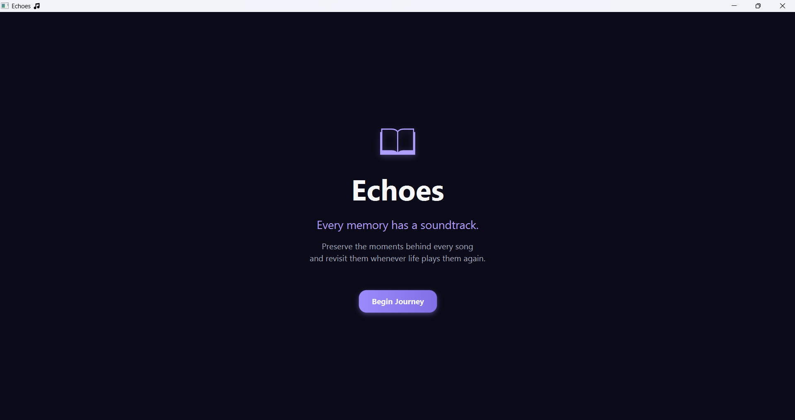
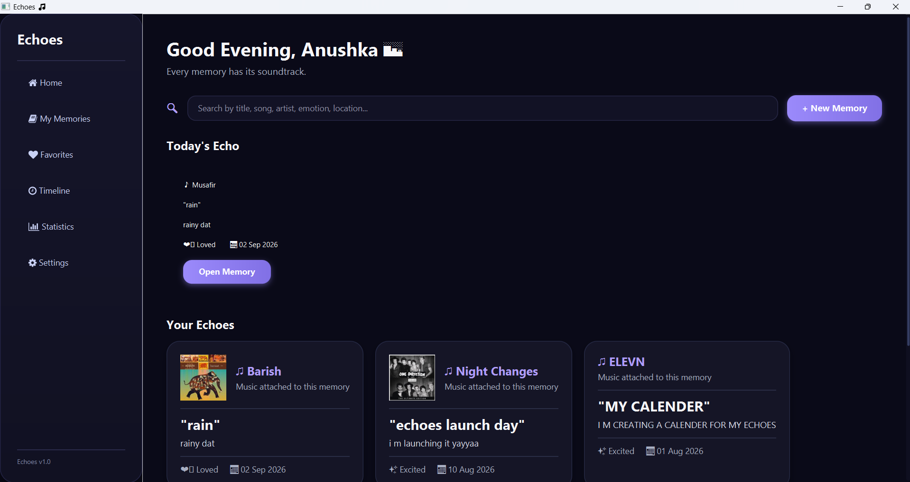
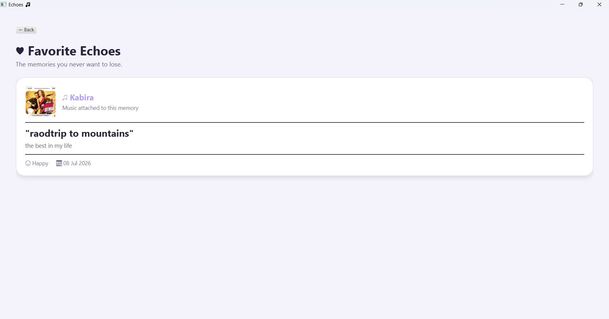
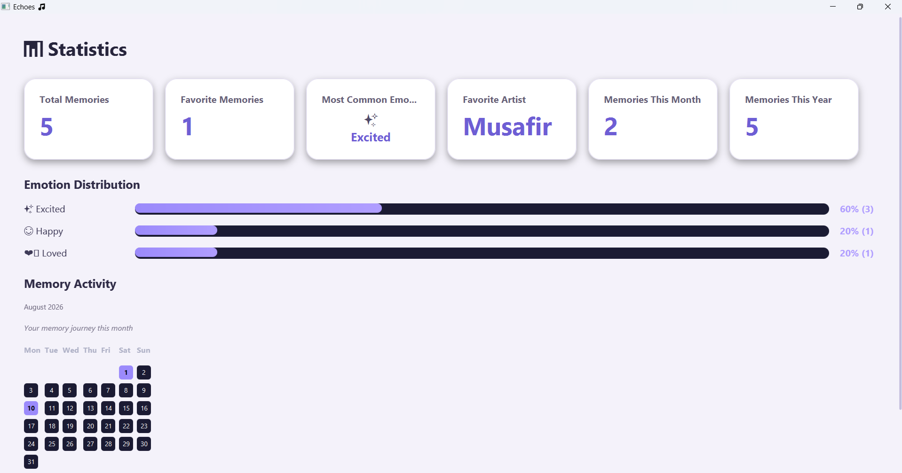

# 🎧 Echoes

> **Every memory has a soundtrack.**

Echoes is a JavaFX-based digital memory vault that lets users preserve meaningful moments through music.

Create a memory, associate it with a song, record the story behind the moment, capture its emotion, date, and location, and revisit those memories through a personalized music-driven experience.

---

## ✨ Features

- 🔐 User registration and login
- 🧠 Create, edit, and delete memories
- 🎵 Music search using the iTunes Search API
- 🖼️ Album artwork integration
- 🎧 Optional audio file attachment
- ❤️ Favorite and unfavorite memories
- 🔎 Search memories
- 📅 Timeline view
- 📊 Memory statistics
- 🏠 Personalized dashboard
- ⚙️ Profile and settings management
- 🌙 Echoes Midnight theme
- ☀️ Soft Day theme
- 🚪 Session management and logout
- 💾 Persistent MySQL storage

---

## 🏗️ Architecture

Echoes follows a layered architecture based on separation of concerns:

```text
┌──────────────────────────────┐
│        JavaFX UI / FXML      │
└──────────────┬───────────────┘
               ↓
┌──────────────────────────────┐
│         Controllers          │
└──────────────┬───────────────┘
               ↓
┌──────────────────────────────┐
│           Services           │
└──────────────┬───────────────┘
               ↓
┌──────────────────────────────┐
│             DAO              │
└──────────────┬───────────────┘
               ↓
┌──────────────────────────────┐
│          JDBC / MySQL        │
└──────────────────────────────┘
``` 
External music search is handled through the iTunes Search API.

| Layer           | Technology                 |
| --------------- | -------------------------- |
| Language        | Java 17                    |
| UI              | JavaFX                     |
| Build Tool      | Maven                      |
| Database        | MySQL                      |
| Database Access | JDBC                       |
| Music API       | iTunes Search API          |
| Architecture    | Controller → Service → DAO |
| IDE             | IntelliJ IDEA              |

🎵 Music Integration

Echoes integrates with the iTunes Search API to search for music and retrieve track information such as:

Song title
Artist
Album artwork
Track metadata

Music information is represented through the Track model and used when creating memories.

🗄️ Database

Echoes uses MySQL for persistent storage.

The database layer includes:

DatabaseConnection
UserDAO
MemoryDAO
TrackDAO

Database operations use JDBC and prepared statements.

Database setup scripts are included in the database/ directory.

🎨 UI & Themes

Echoes uses an atmospheric dark indigo and lavender visual language built around the idea of memories and music.

🌙 Echoes Midnight
Deep indigo background
Lavender accents
Dark cards
Soft purple glow
☀️ Soft Day
Light lavender/off-white background
White cards
Dark indigo typography
Softer visual treatment

Theme selection is managed centrally through ThemeManager.

## 📸 Screenshots

### 🌙 Welcome



### 🏠 Dashboard



### 📝 Add Memory


### ❤️ Favorites



### 📊 Statistics


## 📁 Project Structure

```text
Echoes-App/
│
├── database/
│   ├── 01_create_users_table.sql
│   └── 01_setup.sql
│
├── src/
│   └── main/
│       ├── java/
│       │   └── com.echoes.echoes/
│       │       ├── animation/
│       │       ├── controller/
│       │       ├── database/
│       │       ├── model/
│       │       ├── music/
│       │       ├── navigation/
│       │       ├── service/
│       │       ├── session/
│       │       ├── spotify/
│       │       ├── ui/
│       │       └── util/
│       │
│       └── resources/
│           ├── css/
│           ├── fxml/
│           └── spotify.properties.example
│
├── pom.xml
├── mvnw
├── mvnw.cmd
└── .gitignore
```
